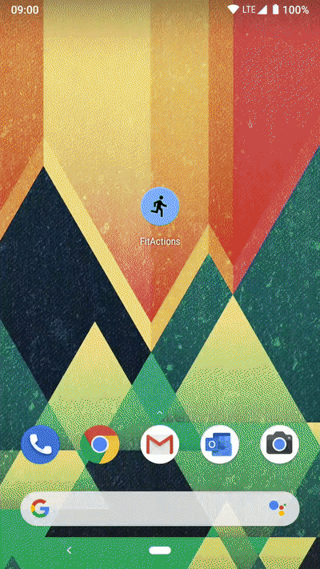
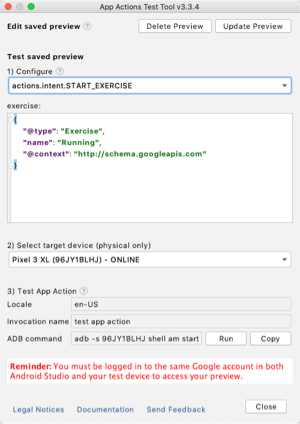

# App Actions Fitness Basic Sample - Codelab Complete

## Codelab Complete

For detailed instructions on using this code, refer to the [Extend an Android app with App Actions](https://codelabs.developers.google.com/codelabs/appactions) codelab.

## App Sample Overview

This is a sample Fitness application that allows displaying workout information as well as starting
and stopping a workout. By implementing [App Actions](https://developers.google.com/actions/app/ ),
we allow the user to call upon our application to fulfill supported actions from our Fitness
vertical Assistant
[built-in intents (BIIs)](https://developers.google.com/actions/discovery/built-in-intents).

Specifically, this sample supports the following BIIs:
* `START_EXERCISE` - opens the sample app and starts an exercise session
* `STOP_EXERCISE` - opens the sample app and stops the current exercise session.



## App Actions Overview

With [App Actions](https://developers.google.com/actions/app/ ), your app can be triggered by users
through the Google Assistant on Android devices. To support App Actions, your app must implement
[Android deep links](https://developer.android.com/training/app-links/deep-linking) to your app
content, allowing the Android system to invoke a specific Activity when the App Action is triggered.

Users invoke App Actions through phrases associated with
[built-in intents (BIIs)](https://developers.google.com/actions/discovery/built-in-intents). The
Assistant handles these BIIs so that your app receives the user's input without you needing to
create a conversational Action, or having to deal with natural language processing by yourself.

You map the BIIs that are relevant to your app and their parameters to your Android deep links
within a file named `actions.xml`. For more details, check out our developer documentation for App
Actions.

## Codelab

For detailed instructions on using this code, refer to the [Extend an Android app with App Actions](https://codelabs.developers.google.com/codelabs/appactions) codelab.

## Importing this sample

Check out or download the project to your preferred location. You can import the project using the
Android Studio with the following steps:

1. Select "**Open an existing Android Studio project**" from the initial screen, or **File --> Open**
2. Find the directory where you saved the sample.
3. Select the `build.gradle` file
4. Follow the instructions presented by the IDE.

## Requirements

Since the App Actions feature is in Developer Preview, to run the sample or use
App Actions in any other app, a few extra steps are required.

The `actions.xml` file that defines the supported actions for your app (or in this case the sample),
needs to be uploaded into the Assistant. This is done via the App Actions Test Tool Android Studio
plugin (the installation instructions are listed below).

For security and verification reasons, when uploading the `actions.xml` file with the plugin, the
account used, must have ownership of the application ID.

Login in Android Studio with your account and use one of your published applications IDs
in Google Play Console. If you don't have any, you can upload one in draft mode
(it does not have to be published).

Change the `applicationId` in [app/build.gradle](https://github.com/actions-on-google/appactions-fitness-kotlin/blob/e83ed77b02fe056f767f2da5f0bbe5bd5b23f95c/app/build.gradle#L31)
```groovy
android {
    defaultConfig {
        applicationId "com.MYUNIQUENAME.android.fitactions" // Use one of your published applications IDs
    }
}
```

Also, [Google Assistant](https://assistant.google.com/) must be installed on the test/target device
with the same account used in Android Studio.

## How to run

Once the requirements above are satisfied, you are ready to run the sample.

1. Run the code and install the sample in the device (Run `app`)
2. Open the App Actions plugin (Tools -> App Actions Test Tool)
3. Define an invocation name that will be used to trigger the actions (i.e My Fit App)
4. Press 'Create Preview'. If the setup was successful, you will see a panel like this



5. Select the action and click run.

The Assistant should show up and run the selected action.

Once you run this once, you can then try using voice or written commands directly in the
Assistant.

### Installing the App Actions plugin

1. If you are using Linux or Windows, click on **File → Settings**. For MacOS, click on
**Android Studio → Preferences**
2. Select the **Plugins** section
3. Search for "**App Actions Test Tool**"
4. **Install** and restart your IDE

## Troubleshooting

Make sure that you follow these steps:

* Own a Google account
* Application ID used is published in Google Play console (at least as draft)
* Google Account has access to the application in Google Play Console
* Logged in Android Studio with the Google Account
* Logged in with the same account in the testing device
* Actions.xml file is defined in the Application project
* Upload preview using App Actions plugin
* App is available in the device.

If the plugin is not able to load the preview of the action, make sure that:

* The account used in Android Studio is the same as the one in the device
* The account used must own or have access in Play console to the applicationId defined
in `build.gradle`
* Android Studio has access to an internet connection.
* If you modified the `actions.xml`, make sure the right syntax is used.

If the action is not running in the device or Assistant is not reacting, make sure that:

* The plugin loaded the actions preview at least one time.
* The account in the device is the same as the one in Android Studio.
* The device has access to an internet connection.
* You are using the latest version of the Assistant or Google app.

App Actions is in Developer Preview, you can't upload an application to Google Play that
defines actions in the `AndroidManifest.xml`. Remove the metadata tag to upload it

```xml
<meta-data
    android:name="com.google.android.actions"
    android:resource="@xml/actions" />
```

## License
```
Copyright 2019 Google LLC

Licensed under the Apache License, Version 2.0 (the "License");
you may not use this file except in compliance with the License.
You may obtain a copy of the License at

   https://www.apache.org/licenses/LICENSE-2.0

Unless required by applicable law or agreed to in writing, software
distributed under the License is distributed on an "AS IS" BASIS,
WITHOUT WARRANTIES OR CONDITIONS OF ANY KIND, either express or implied.
See the License for the specific language governing permissions and
limitations under the License.
```
